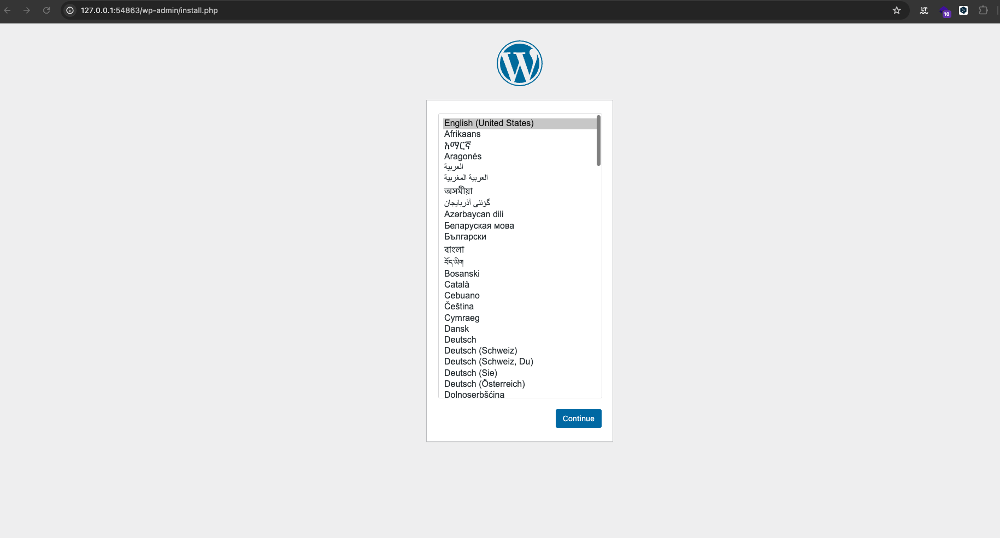

# TP final : Déployer un site web wordpress sur kubernetes 

Vous venez d'integrer l'équipe DevOps de `Le Cloud Facile` et votre premiére mission est de déployer la plateforme sur kubernetes. 
Votre superieur veut que vous lui présenter un PoC (Proof of Concept) du projet. 
Pour valider le PoC, vous devez partager les fichiers yaml sur un repo git et le partager avec le compte github [mmkmou](https://github.com/mmkmou).


1. **Créer un secret pour stocker le mot de passe**

- Créer un secret  nommé `db-password` avec les informations keys/values suivantes : 

```yaml
password: Azerty@12
```
Le secret doit être stocké sur un fichier nommé `db-password.yaml`


2. ** Créer un configmap pour stocker les informations de la base de donnée **

- Créer un configmap  nommé `db-information` avec les informations keys/values suivantes : 

```yaml
dbname: wordpress
user: wordpress
```
Le configmap doit être stocké sur un fichier nommé `db-information.yaml`

3. **Créer le stockage pour la base de donnée mysql et l'application wordpress**

- créer un PVC nommé `pvc-wordpress` avec les informations suivantes : 

```yaml
accessModes: ReadWriteOnce
storage: 10Gi
```

Le PVC doit être dans un fichier yaml avec le nom `pvc-wordpress.yaml`

- Créer un autre PVC nommé `pvc-mysql` avec les informations suivantes : 

```yaml
accessModes: ReadWriteOnce
storage: 10Gi
```
Le PVC doit être dans un fichier yaml avec le nom `pvc-mysql.yaml`

> Pas besoin de créer un PV sur minikube il sera créé automatiquement 


4. **Créer le _deployment_ `mysql` contenu dan un fichier du même nom `mysql.yaml`**

- Vous pouvez vous baser sur le format suivant 

```yaml
apiVersion: apps/v1
kind: Deployment
metadata:
  name: mysql
  labels:
    app: mysql
spec:
  replicas: 1
  selector:
    matchLabels:
      app: mysql
  template:
    metadata:
      labels:
        app: mysql
    spec:
      containers:
      - name: database
        image: mysql:5.7
        ports:
        - containerPort: 3306
```

- Vous devez ajouter la variable d'environnement suivante : 

- - `MYSQL_ROOT_PASSWORD` qui correspond au secret `password`


- Vous devez aussi monter  le volume  `pvc-mysql` créé précédemment sur  `/var/lib/mysql`


5. **Créer un service de type ClusterIP nommé `mysql-svc` pour permettre l'exposition du déploiement `mysql`. Le fichier `yaml` doit être nommé mysql-svc.yaml**


6. **Executer le yaml suivant pour créer un pod phpmyadmin et l'exposer pour accéder à la base de donnnée `mysql`**

```yaml
apiVersion: v1
kind: Pod
metadata:
  labels:
    run: phpmyadmin
  name: phpmyadmin
spec:
  containers:
  - image: phpmyadmin
    name: phpmyadmin
    env:
    - name: PMA_HOST
      value: mysql-svc
---
apiVersion: v1
kind: Service
metadata:
  labels:
    run: phpmyadmin
  name: phpmyadmin
spec:
  ports:
  - port: 80
    protocol: TCP
    targetPort: 80
  selector:
    run: phpmyadmin
  type: NodePort
```

> Si vous êtes sur minikube vous devez executer la commande suivante : `minikube service phpmyadmin` 

7. **Créer maintenant le déploiement nommé `wordpress` avec un fichier du même nom contenant les informations suivantes :**

```yaml
replicas: 3
image: wordpress:6.5.3-php8.3-fpm-alpine
volumeMount: /var/www/html
initContainers: 
- image: busybox
- Command: ['sh', '-c', "until nslookup mysql-svc.$(cat /var/run/secrets/kubernetes.io/serviceaccount/namespace).svc.cluster.local; do echo en attente de mysql-svc; sleep 2; done"]
env: 
- WORDPRESS_DB_HOST: nom du service mysql
- WORDPRESS_DB_PASSWORD: le mot de passe depuis le secret
- WORDPRESS_DB_USER: le user depuis le config map
- WORDPRESS_DB_NAME: la base de donnée depuis le config map
```


8. **Exposer le deploiement wordpress via NodePort ou LoadBalancer**


Eureka 



